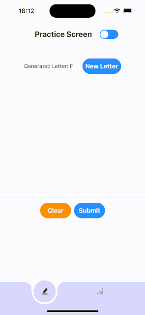
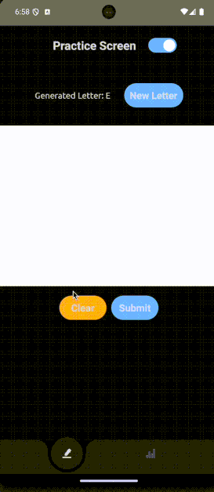

# React Native Mobile Home Assignment

This repository contains a **React Native application** developed for the **A Mobile Home Assignment**, using **React Native CLI**.
This React Native application allows users to practice drawing letters with real-time feedback and track their progress through a statistics tab.

## Features

### Practice Tab

- **Random Letter Display**: Displays a random letter on each visit or upon pressing "New Letter".
- **User Drawing Input**: Allows users to draw the displayed letter on a touch-enabled canvas.
- **OCR Integration**: Submits the drawing to a third-party OCR API to retrieve recognized text.
- **Feedback Notification**: Provides real-time feedback indicating success or failure in matching the drawn letter.

### Statistics Tab

- **Summary**:
  - Displays total attempts.
  - Success rate as a percentage.
- **History**:
  - Timestamps of attempts.
  - Required letter.
  - Attempt result (Success/Failure).

## Screenshots / Demo




## Installation & Setup

### Prerequisites

Firstly make sure you have **_Node.js_** installed on your locale machine.
Ensure you have completed the [React Native Environment Setup](https://reactnative.dev/docs/environment-setup) for your platform (macOS/Windows/Linux).
And have an emulator for iOS and Android to run it locally on your machine.

### 1. Clone the Repository

```bash
git clone https://github.com/codenico05/home-assignment.git
cd homeAssignment
```

### 2. Install dependencies

```bash
yarn install
```

### 3. Install needed Pods. (for iOS)

```bash
cd ios && pod install
```

### 5. Create .env file locally

Create a local .env file with these env variables.

```bash
   API_KEY = 'api-key' # fill in the api key correctly.
   BASE_URL = 'base-url' # base url of the api.
```

### 4. Start Metro bundler

```bash
yarn start
```

## To run the project

### iOS

```bash
# or you can just press 'i' in the metro terminal
yarn ios
```

### Android

```bash
# or you can just press 'a' in the metro terminal
yarn android
```

# Folder Structure

```bash
<project-root>
│
├── src
│   ├── api               # API instance structure and helpers
│   ├── app               # Custom hooks
│   ├── assets            # Practice and Statistics screens
│   ├── components        # Main UI components
│   ├── context           # React Context for managing global state or sharing data across components
│   ├── hooks             # Custom React hooks for reusability
│   ├── screens           # Screens like "PracticeScreen" and "StatisticsScreen"
│   ├── styles            # Styling and theme
│   ├── ui-kit            # Reusable BASE UI components
│   └── utils             # Utility functions and helpers
│
├── .env                  # Environment variables
├── README.md             # Project documentation
└── package.json          # Project dependencies and scripts
```
